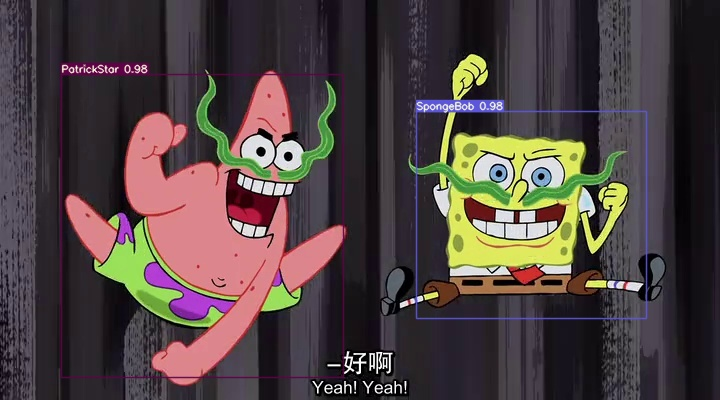
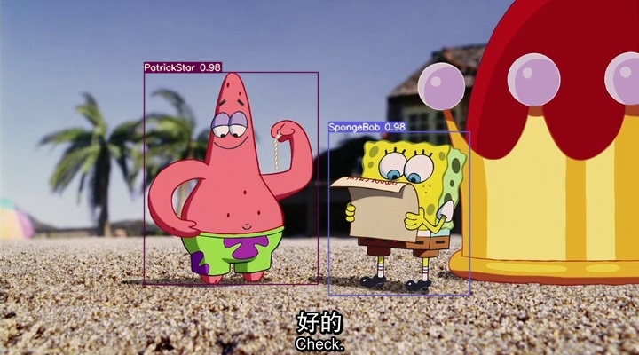
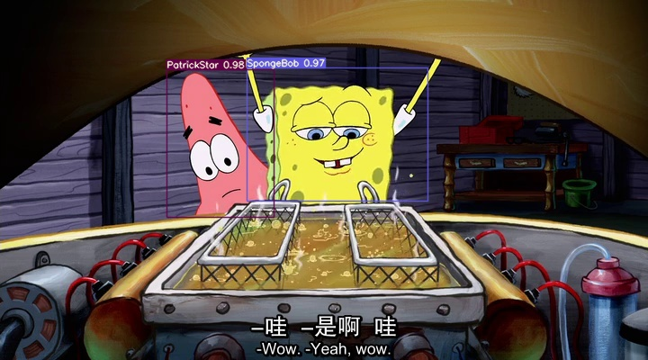

# 使用yolov7对海绵宝宝进行检测

## 简介

使用yolov7对海绵宝宝进行检测

## 技术栈

- **yolov7**

## 安装步骤

```bash
git clone https://github.com/jetshuanhaun/yolov7-target-detection.git   
cd yolov7-target-detection
pip install -r requirements.txt
python detect.py --source "hm.mp4" --view-img
```


## 截图






